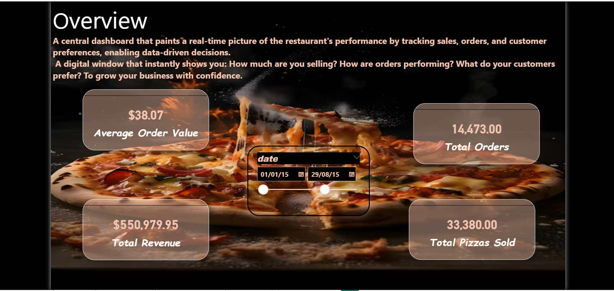

# Pizza Sales Dashboard — Power BI

An interactive **Power BI** dashboard for analyzing pizza restaurant sales data, designed to provide management with clear insights into sales performance and support strategic decision-making.

---

## 📖 Overview

This project is an interactive **Dashboard** built using **Power BI** to analyze pizza restaurant sales data. The dashboard aims to provide restaurant management with clear insights into sales performance, helping them make strategic decisions to improve operations and increase profits.

**Added Value:**

- Understand customer preferences for the most-ordered pizza types.
- Identify peak hours to optimize staff scheduling and inventory management.
- Plan marketing campaigns based on the best-selling months and days.

---

## 📸 Dashboard Preview

### 📊 Overview

### 💰 Sales Details

### ⏰ Order Details by Hour

### 📅 Monthly Performance

### 🎛️ Interactions Panel

---

## 🍕 Top-Selling Pizza Types

The dashboard analyzes sales by pizza type to identify the most-ordered and highest-revenue categories.

**Key Findings:**

- **Best-selling pizza by quantity:** Pepperoni.
- **Highest-revenue pizza:** The Greek Pizza.
- **Least-ordered pizza:** Classic.

---

## ⏰ Peak Hours Analysis

Sales data was analyzed by hour to identify time periods with the highest purchase activity.

**Key Findings:**

- **Peak hours:** Between **12:00 PM – 2:00 PM** and **6:00 PM – 9:00 PM**.
- **Lowest-selling hour:** Around **10:00 AM**.
- **Recommendation:** Increase staff during peak hours to reduce waiting time and improve customer experience.

---

## 📅 Monthly Sales Analysis

Sales performance was analyzed across months to identify the most profitable seasonal periods.

**Key Findings:**

- **Best-selling months:** July, August, and December.
- **Lowest-selling months:** January and February.
- **Recommendation:** Launch special offers or seasonal menus during low-sales months to stimulate demand.

---

## 📆 Daily Sales Analysis

Sales were analyzed by day of the week to identify the most and least active days.

**Key Findings:**

- **Best-selling days:** Friday and Saturday.
- **Lowest-selling days:** Monday and Tuesday.
- **Recommendation:** Offer "Day of the Week" promotions such as "Monday Deal" to boost sales on slow days.

---

## 🛠️ Tools & Technologies

- **Power BI Desktop** — Building the data model and visualizations.
- **DAX (Data Analysis Expressions)** — Creating custom measures (e.g., total sales, average order value).
- **Power Query** — Data cleaning and transformation (removing duplicates, handling missing values).
- **Data Source:** Excel / CSV / SQL containing order records.

---

## 🚀 How to Use

1. Download the `.pbix` file from this repository.
2. Open the file using **Power BI Desktop** (version 2023 or later).
3. Explore the dashboard and interact with the filters to gain different insights.

---

## 📁 Project Structure

| File / Folder | Description |
|---|---|
| `pizza.pbix` | Main Power BI project file. |
| `data/pizza_sales.csv` | Sales data (sample). |
| `images/` | Dashboard screenshots. |
| `README.md` | This documentation file. |

---

## ⚠️ Important Notes

- The data used in this project is **sample data** for educational purposes and skill demonstration only.
- Visualizations can be modified and new measures can be added based on business needs.
- The dashboard is designed to be compatible with desktop devices and large displays.
